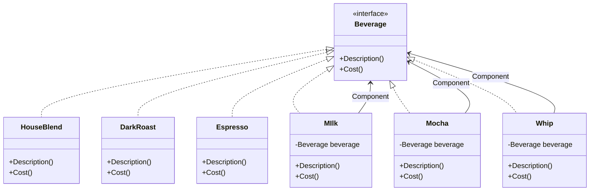

```mermaid
classDiagram

class Beverage {
  <<interface>>
  +Description()
  +Cost()
}

class HouseBlend {
  +Description()
  +Cost()
}
class DarkRoast {
  +Description()
  +Cost()
}
class Espresso {
  +Description()
  +Cost()
}

class MIlk {
  -Beverage beverage
  +Description()
  +Cost()
}

class Mocha {
  -Beverage beverage
  +Description()
  +Cost()
}

class Whip {
  -Beverage beverage
  +Description()
  +Cost()
}

Beverage <|.. HouseBlend
Beverage <|.. DarkRoast
Beverage <|.. Espresso

Beverage <|.. MIlk
Beverage <|.. Mocha
Beverage <|.. Whip

Beverage <-- MIlk : Component
Beverage <-- Mocha : Component
Beverage <-- Whip : Component

```
