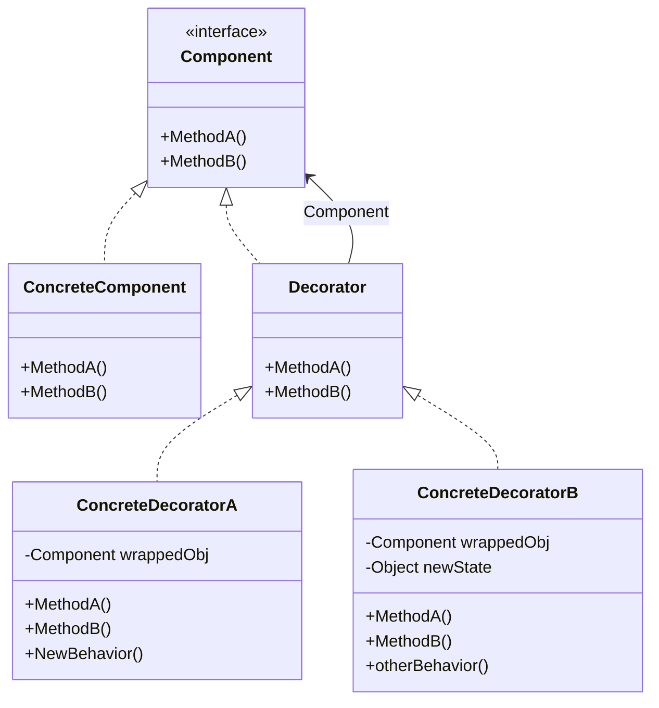

```mermaid
classDiagram

class Component {
  <<interface>>
  +MethodA()
  +MethodB()
}

class ConcreteComponent {
  +MethodA()
  +MethodB()
}

class Decorator {
  +MethodA()
  +MethodB()
}

class ConcreteDecoratorA {
  -Component wrappedObj
  +MethodA()
  +MethodB()
  +NewBehavior()
}

class ConcreteDecoratorB {
  -Component wrappedObj
  -Object newState
  +MethodA()
  +MethodB()
  +otherBehavior()
}

Component <|.. ConcreteComponent
Component <|.. Decorator
Component <-- Decorator : Component
Decorator <|.. ConcreteDecoratorA
Decorator <|.. ConcreteDecoratorB

```
