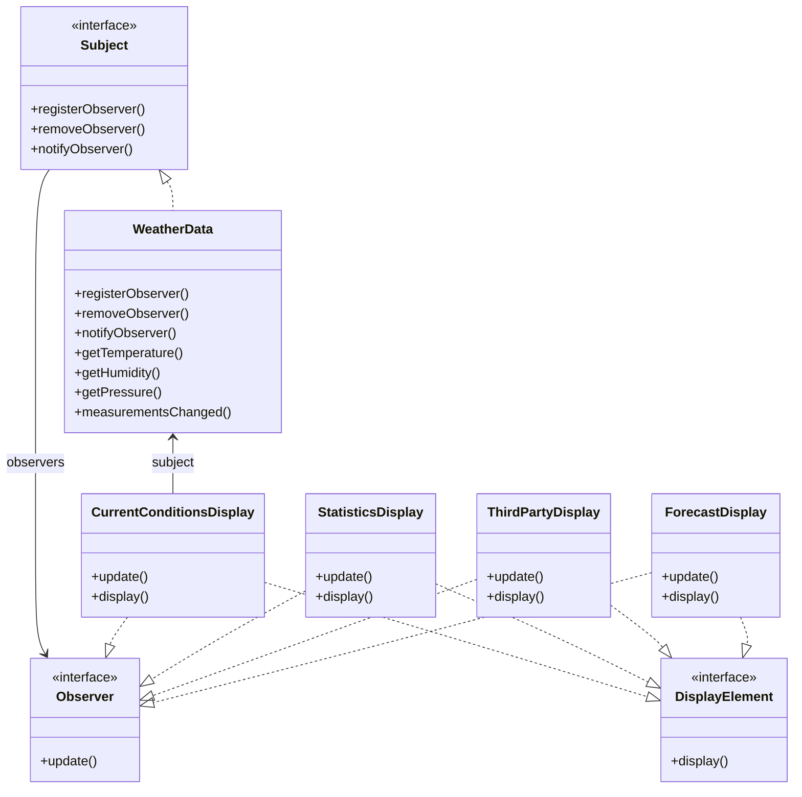

```mermaid
classDiagram

class Subject {
  <<interface>>
  +registerObserver()
  +removeObserver()
  +notifyObserver()
}

class Observer {
  <<interface>>
  +update()
}

class DisplayElement {
  <<interface>>
  +display()
}

class WeatherData {
  +registerObserver()
  +removeObserver()
  +notifyObserver()

  +getTemperature()
  +getHumidity()
  +getPressure()
  +measurementsChanged()
}

class CurrentConditionsDisplay {
  +update()
  +display()
}

class StatisticsDisplay {
  +update()
  +display()
}

class ThirdPartyDisplay {
  +update()
  +display()
}

class ForecastDisplay {
  +update()
  +display()
}


Subject --> Observer : observers
Subject <|.. WeatherData
WeatherData <-- CurrentConditionsDisplay : subject

CurrentConditionsDisplay ..|> DisplayElement
CurrentConditionsDisplay ..|> Observer

StatisticsDisplay ..|> DisplayElement
StatisticsDisplay ..|> Observer

ThirdPartyDisplay ..|> DisplayElement
ThirdPartyDisplay ..|> Observer

ForecastDisplay ..|> DisplayElement
ForecastDisplay ..|> Observer

```
