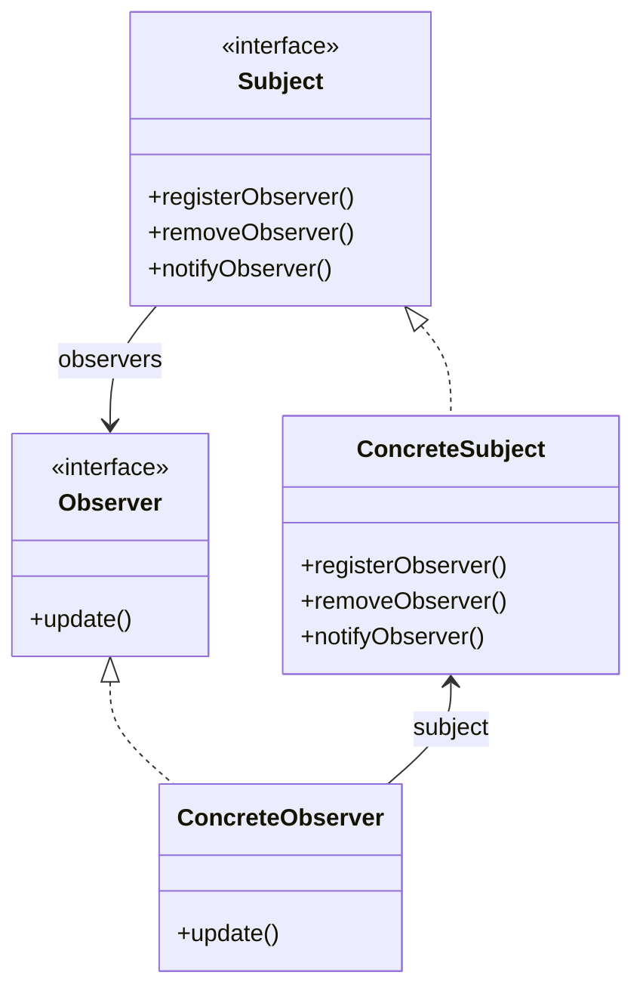

```mermaid
classDiagram

class Subject {
  <<interface>>
  +registerObserver()
  +removeObserver()
  +notifyObserver()
}

class ConcreteSubject {
  +registerObserver()
  +removeObserver()
  +notifyObserver()
}

class Observer {
  <<interface>>
  +update()
}

class ConcreteObserver {
  +update()
}


Subject --> Observer : observers
Subject <|.. ConcreteSubject
Observer <|.. ConcreteObserver
ConcreteSubject <-- ConcreteObserver : subject

```
